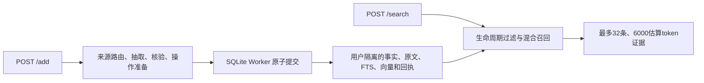

# Agent Memory Service

从固定版本 Mem0 TypeScript 源码改造的独立记忆服务，包含自己的准备、核验、生命周期、原子提交和恢复机制。只开放 `POST /add`、`POST /search`、`GET /health`；不生成最终答案，不导入 eval，也不读取问题答案或 rubric。Mem0来源、修改范围和许可见 [UPSTREAM.md](UPSTREAM.md)。

当前为 V1 候选，正式发布仍需完整小集、全量评测和交付归档验收。工作区 README 和 V1交付计划是交付入口；[历史研发记录](docs/EXPERIMENTAL-HISTORY.md) 中的实验开关不代表发布默认值。

## 启动

需要 Node 24.18.0。独立增强服务：

```sh
npm ci
npm run build
npm test
cp -n .env.example .env
# 填写 .env 中可访问的模型地址与凭据，然后：
node --env-file=.env dist/server.js
```

也可使用 `npm start`（已编译运行）、`npm run dev`（源码变化自动编译重启）、`npm run debug`（自动重启并开放本机9229调试端口）。三个命令自动读取本仓库 `.env`，不需要 Docker 或 eval。调试支持 TypeScript source map；编译包含 SQLite Worker，失败时不会继续运行旧服务。Ctrl+C 停止并保留数据。

`.env.example` 与工作区 `configs/release-enhanced.env` 保持一致。增强写入使用gpt-5.5，默认辅助模型gpt-5.4-mini；本地Ollama的nomic-embed-text为768维，digest固定在配置中。服务不自动下载模型。离线部署使用工作区独立的 `configs/release-offline.env`，能力与增强模式不同，数据卷也分开。

## 稳定边界

核验支持 `MEMORY_VERIFICATION_FORMAT=named`：模型输入输出使用具名对象及 `fact:…`、`msg:…`、`op:…` 等明确引用，服务端适配回原有证据、覆盖度与授权校验。`compact` 保留用于同预算对照，默认配置暂未切换。该开关不更改数据库格式、HTTP 接口、模型路由或修复预算；仍拒绝未知引用、不完整判定和不确定删除，明确否定不会被重新采样覆盖。



- 同一用户写入串行。准备阶段不直接改库，提交事务统一维护来源、事实、操作、索引和幂等回执；成功响应意味着已提交并可检索。
- 模型抽取与独立核验拒绝无来源事实、错误目标和不合法遗忘；定向修复有次数和总时间上限。发布配置的source-first写入不会静默落到未经核验的离线成功。
- 遗忘清除逻辑可检索内容及受影响依赖，保留独立邻居；更新、纠错、历史状态和明确重新授权有不同语义。测试不等于对物理磁盘或私有诊断追踪完成擦除。
- 不启用重排、多跳、反思、事件视图和覆盖打包。后续改进通过配置进入同预算候选对照，不能绕过生命周期检查。

## 恢复、数据与日志

写入截止115秒，检索55秒。已提交的同ID同载荷请求返回已有回执，改动载荷返回冲突。未完成模型准备仅在同进程、同快照和五分钟有效期内有界继续，最多三个HTTP准备尝试；`WRITE_CONTINUATION_PENDING` 要求完全相同的请求。进程重启失去内存模型响应后明确终止，不承诺跨进程续跑。

每个用户在 `MEMORY_DATA_DIR/sha256(user_id)/memory.sqlite` 保存数据，WAL与FULL同步；增强发布来源格式为 `dual-source-v10-s1`，离线为 `dual-source-v2-s1`。不同来源格式、未知格式或无版本非空数据在打开租户库时拒绝。更换来源格式或向量空间需使用兼容快照，或新目录重新灌入。不要静默迁移旧库。`s1` 表示擦除事实、操作记录与遗忘标记的 scope 仅保留规范化摘要；原始范围不再写入这些记录，活动事实仍保留合法范围。摘要用于精确匹配，不是加密或磁盘安全擦除。无 `s1` 的旧库被明确拒绝，旧版本也不能打开新库；回退必须配套旧版本兼容的数据备份。重新灌入需重放完整合法操作历史，包含遗忘指令，不能只导入早期事实。

`/health` 验证进程与存储工作线程，不替代模型调用验证或逐租户数据兼容性验证。正常HTTP日志只有请求关联、哈希租户、阶段、耗时、状态和错误码。`MEMORY_MODEL_AUDIT` 可记录模型阶段、用量、传输类别和恢复状态；`MEMORY_MODEL_TRACE` 属于含输入输出的私有诊断，不进入正式交付包。备份、恢复、升级、容器命令和运行证据见工作区部署说明。
