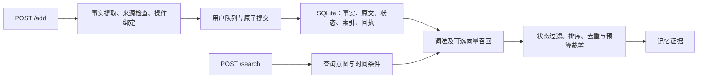

# 系统设计文档

Agent Memory Service 面向跨会话对话，提供长期记忆写入、状态更新、遗忘和证据检索。服务采用 TypeScript、Fastify 与 SQLite。随包默认配置为 `offline`：规则提取、全文检索，无外部模型依赖。源码同时提供 `enhanced` 模型处理路径，配置与用途在第 3 节说明。

## 1. 总体架构

Add 在准备完成后一次性提交，Search 读取已提交数据。同一用户的写入串行执行，各用户使用独立数据库。HTTP 层、记忆处理和存储层分别由 `server.ts`、`engine.ts`、`storage.ts`/`db-worker.ts` 承担。

设计保留事实和原文两种表示。事实用于属性管理、更新判断与排序；原文用于保留短事实容易丢失的时间、关系和事件细节。两类表示共享来源与生命周期约束。

## 2. 记忆处理

### 2.1 记什么

长期记忆包括个人信息、人物关系、偏好、经历、计划及明确的状态变化。常见单值属性有城市、岗位、经理；爱好等属性允许多个值并存。

每条事实记录主体、属性、值、范围、类型、确认程度、时间和来源。确认程度区分 `confirmed`、`tentative`、`hypothetical`、`quoted`、`inferred`。例如“我可能下个月搬去波特兰”属于计划，不能覆盖已经确认的现居城市。

offline 通过规则识别常见属性和个人经历，过滤纯问候、致谢、一般教程及缺少个人信息的问句。人物通过人称和具名参与者识别。enhanced 将对话转成结构化事实和操作提案，再检查逐字来源、事实支持及操作授权；核验失败时在限定范围内修复。

原文段保留说话人和原始跨度，支持未成结构化事实的信息检索。事实过滤与原文留存采用不同粒度，因此部分闲聊仍可能存在于原文层。图像描述须以消息文本提供，服务不执行图像识别。

### 2.2 怎么存

每个 user_id 对应 `MEMORY_DATA_DIR/sha256(user_id)/memory.sqlite`。目录摘要用于租户定位，所有快照、操作绑定、回执和检索都使用当前用户的数据。

| 存储对象 | 内容 |
| --- | --- |
| facts | 结构化事实、状态、来源引用、时间及可选向量 |
| messages / passages | 消息、原文分段、说话人、来源跨度及关联事实 |
| operations / memory_events | 操作类型、前后状态引用和事件记录 |
| markers | 遗忘范围、值摘要及用于识别复述的短语摘要 |
| requests | request_id、载荷哈希与成功回执 |
| sessions / meta | 会话时间锚、数据版本、revision 和向量空间 |
| evidence_fts / passage_fts | 事实与原文的 FTS5 全文索引 |

同一次事务写入事实、来源、操作、索引及回执。SQLite 使用 WAL 与 FULL 同步。Add 返回 200 时，新增内容已经可检索；相同请求重放返回已存回执，改变载荷则返回冲突。

全文索引采用 `porter unicode61`。事实和原文的向量分别保存在同一 SQLite 的 `facts.body`、`passages.body` JSON 内，vector 为归一化数值数组；offline 或未生成向量时为 null。检索从库中读取向量并在进程内计算相似度，没有独立向量数据库。查询向量不写入记忆库，模型权重由外部模型服务管理。

默认 offline 数据目录为 `.data-offline/`，enhanced 为 `.data-enhanced/`，均可由 `MEMORY_DATA_DIR` 指定绝对路径。向量与模型标识、维度和权重摘要对应；不兼容的来源格式或向量空间需要独立数据目录。

每轮完整评测使用新空目录，或停服后删除整个原目录，同时清除文本、向量、索引、回执及遗忘边界。评测初始化与中途继续运行的区别、清库命令见 [INSTRUCTION.md 第 5 节](INSTRUCTION.md#5-数据与评测初始化)。

### 2.3 怎么召回

Search 在同一用户的全部会话中查找证据，流程如下：

1. 识别当前状态、历史、列表、操作或轨迹意图，提取时间条件。
2. 过滤已擦除、依赖失效和不适用于查询的事实。假设与引用不作为已确认的当前事实。
3. 从事实和原文两个全文索引召回候选；模型模式可增加向量候选，以 RRF 合并词法、向量和实体信号。
4. 按主体、确认程度和状态排序。当前已确认值优先；未决冲突保留标注，不能仅凭出现次数确认为真。
5. 去重，结合来源覆盖度选择证据，按条数与估算 token 预算裁剪。

多值属性可生成带来源依赖的聚合记录，便于跨会话列表召回。操作查询可从存储事件投影状态轨迹。结果内容均来自已保存的事实、原文或操作记录。

默认最多返回 32 条、约 6000 token，同时不超过请求 top_k 和硬上限 100。`options` 中的字符串仅辅助已有证据匹配。返回字段为 `id`、`content`、`score`、`created_at`，最终答案由评测平台生成。

### 2.4 更新与遗忘

事实状态分为 `active`、`conflicted`、`superseded`、`retracted`、`erased`。同槽属性按主体、规范化属性名和范围识别。

| 操作 | 处理方式 |
| --- | --- |
| update | 新状态取代同槽旧值，合法旧值保留为历史 |
| correct | 撤回错误陈述，不将其作为有效历史事实 |
| retract | 撤回用户指定的关系或陈述 |
| forget | 清理目标事实、相关原文和派生内容，并建立防重入记录 |
| restore | 根据明确的新授权和来源重新记忆 |

例如，先写入“I live in Oslo”，再写入“I now live in Portland”，默认规则配置将 Portland 作为当前城市，Oslo 仅用于允许的历史查询。未确认的搬迁计划不覆盖当前城市。

遗忘先绑定主体、属性和目标值，再处理对应事实、来源跨度与依赖。用户要求遗忘门禁码时，与它出现在同一消息中的经理信息应继续保留。同一个数字出现在不同属性中，也需要分别判断授权范围。聚合记录按成员处理，保留未受影响的成员。

遗忘记录使用完整 token、值摘要和短语摘要匹配，抑制旧消息重放及部分换词复述。无法可靠绑定的明确遗忘请求返回错误，避免误删其它内容。逻辑检索清除覆盖事实、原文、索引和派生内容；磁盘空闲页、WAL、备份及外部模型日志不属于物理擦除范围。

### 2.5 与短期记忆的边界

提取使用同会话最多十条历史消息作为上下文，辅助指称和时间理解。这些消息从持久存储读取，Search 则从事实、原文和合法事件视图返回证据。

稳定属性、偏好、经历、计划及操作结果进入长期表示；一般对话修辞和无个人信息的提问不形成独立事实。为保留证据，原文层仍可能包含这些内容。

时间同时保留原表达与可识别的锚点。缺少 timestamp 时生成顺序标记，不将其作为真实日期；相对时间的输出保留原始粒度和不确定性。

## 3. 模型与工程实现

### 3.1 模型用途及启用条件

| 资源 | 配置模型 | 实际用途与调用条件 |
| --- | --- | --- |
| 提取模型 | glm-5.2 | enhanced Add：提取事实与操作提案 |
| 核验模型 | glm-5.2 | enhanced Add：来源、操作授权、擦除范围及状态转移核验 |
| 修复模型 | glm-5.2 | enhanced Add：对未通过项生成有限范围的修复补丁 |
| 通用模型 | glm-5.2 | 阶段模型未指定时的默认值；也用于可选重排和查询焦点处理，两种随包配置均关闭这两项 |
| Embedding | nomic-embed-text:latest，768 维 | enhanced Add：事实及原文向量；enhanced 且检索方式非 lexical 的 Search：查询向量 |
| offline | 不调用模型 | 规则提取与本地词法检索 |

模型资源由 `configs/models.env.example` 预留。LLM 使用 OpenAI 兼容 Chat Completions 接口，三个阶段可分别设置模型名，共用地址和凭据。Embedding 使用 Ollama 的 `/api/tags` 与 `/api/embed`，可配置地址、模型名、维度、权重摘要及 Bearer Key；普通本地 Ollama 可不设置 Key。

`nomic-embed-text` 的写入和查询分别添加 `search_document:`、`search_query:` 前缀，向量归一化后存储和比较。服务校验返回数量、维度和数值有效性。配置了权重摘要时，调用前先核对加载模型。服务不会自动下载模型。配置方法见[模型与运行配置](docs/CONFIGURATION.md)。

### 3.2 超时、失败与部署

内部 Add 截止时间为 115 秒，Search 为 55 秒。排队、重试和修复共享请求预算。模型模式的部分网络或协议故障可以退回确定性准备，明确的语义否定和未解决的操作授权仍返回错误。Embedding 失败时保留词法检索。

默认配置使用 `dual-source-v2-s1`，模型配置使用 `dual-source-v5-s1`，两者使用不同的数据目录。来源格式不匹配时拒绝访问对应租户数据库；恢复需匹配代码、配置和数据。

推荐使用 Node.js 24.18.0 从源码构建运行，SQLite Worker 与主服务一同编译。Docker 作为备选，受内网条件限制，尚未完成评测内网的构建与启动验证。Health 检查引擎与 SQLite/FTS 就绪。普通 HTTP 日志记录请求关联、阶段、耗时和错误码，正文与凭据不进入这些日志。

## 4. 方案特点与扩展

**事实与原文共同维护状态。** 结构化事实支持更新判断，原文保留上下文；同一来源上的擦除可以同步作用于两种表示，减少旧信息从原文重新进入检索结果的机会。

**派生记录保留成员依赖。** 列表聚合记录能够追溯到各成员的来源。删除某一成员时按依赖重建，保留独立信息，兼顾列表召回与定向遗忘。

**准备与发布分开。** 模型或规则先完成提取、检查和操作绑定，再由存储事务统一发布。索引与回执同事务，保证写入结果和外部成功响应一致。

模型适配、核验协议和检索评分各自独立，可替换模型或增加候选通道。当前采用单进程、单 SQLite Worker；进一步扩大数据规模需处理大租户扫描和工作线程竞争。

## 5. 已知限制

- offline 的复杂回指、长叙事操作和中文规则覆盖有限，可能漏提或拒绝请求。
- 原文留存有助于保真，也会增加噪声；top-32 和 token 预算可能裁掉长尾证据。
- 缺少可靠时间锚、说话人或明确授权时，系统可能无法确定状态或操作目标。
- enhanced 在模型不可达时无法保证完整的更新语义。已知示例是城市更新后新旧值均标为冲突未决，因此默认运行配置保持 offline。复现说明见[验证结果](docs/VALIDATION.md)。
- 遗忘是逻辑检索清除，摘要并非加密，低熵内容仍可能被猜测；备份和外部日志需单独管理。
- 当前验证覆盖构建、服务契约和回归场景，正式问答准确率由比赛评测确定。
