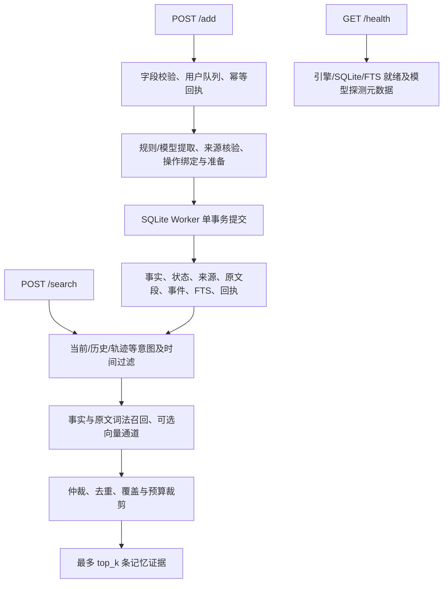

# 系统设计文档：可独立部署的长期记忆服务

本方案面向 AML Textual 记忆写入与证据检索。服务基于 TypeScript、Fastify 和 SQLite，核心是**具有来源证据的事实及原文双层存储、用户隔离的状态管理、按查询意图过滤的召回，以及贯穿事实/原文/派生物的定向遗忘**。

本文依据当前 service 代码整理，覆盖交付要求的六项设计内容，并披露 Add 内部的模型及用途。默认提交配置是 `configs/release-offline.env`；可选模型配置为 `configs/release-enhanced.env`。来源材料及历史口径差异见 [文档核对说明](docs/SOURCE-RECONCILIATION.md)，部署见 [INSTRUCTION.md](INSTRUCTION.md)。

## 1. 方案与架构合理性

### 1.1 目标、系统边界与工程组成

服务负责将分批跨会话对话写入长期记忆，并根据查询返回可追溯证据。它不承担 Answer/Judge，不访问评测 gold、rubric 或题号答案映射，不在运行时依赖 eval 或 workspace。

三项设计选择贯穿实现：保留长形原文以减少短事实压缩丢失；将更新、纠错和遗忘表达为可审计的状态/事件变化；在检索输出前区分当前状态与历史陈述，降低旧值混入当前证据的机会。

| 模块 | 职责与源码位置 |
| --- | --- |
| 接口与配置 | `src/server.ts`、`types.ts`、`config.ts`：字段、时限、错误、配置组合校验 |
| 写入编排 | `src/engine.ts`：用户队列、快照、准备、提交、回执及可选续传 |
| 提取与验证 | `src/extraction.ts`、`extraction-*.ts`、`verification*.ts`、`repair.ts` |
| 生命周期与来源 | `binding.ts`、`operation-intent.ts`、`erasure.ts`、`transitions.ts`、`source-*.ts` |
| 持久化 | `storage.ts`、`db-worker.ts`：租户数据库、事务、全文索引 |
| 检索与时间 | `retrieval.ts`、`retrieval-policy.ts`、`text.ts`、`temporal.ts`、`events.ts` |
| 模型适配 | `models.ts`、`model-*.ts`：显式模型路由、取消、有限重试与 JSON 恢复 |

### 1.2 记什么：提取策略及噪声边界

长期事实包括身份与关系、当前城市/岗位/经理、偏好和爱好、事件经历、明确计划与状态变化，以及用户授权的更新、纠错、撤回、遗忘、重新记忆操作。每条事实以 `subject/predicate/value/scope` 定位，附 `kind`、`modality`、`cardinality`、时间信息和逐字来源。

offline 使用确定性规则提取常见属性和个人经历。事实准入排除纯问候、致谢、没有个人信息的一般问句/教程、没有具名参与者的普通 assistant 回声；经验事实要求人称或人名等线索。中文有分词和部分属性规则，覆盖范围仍有限。不能把所有自然语言都声称为已可靠识别。

enhanced 使用模型提取结构化事实及操作提案，并执行独立来源/覆盖/操作核验；模型给出的引用必须对应当前用户合法来源。具名与紧凑协议均已实现，交付增强配置选 `compact` + `source_refs`。抽取分片最多 3 路，核验和定向修复仍受总预算约束。

事实的五种 modality 为 `confirmed/tentative/hypothetical/quoted/inferred`。它们不等同于生命周期 state：未确认计划不能因更晚出现而覆盖已确认值，假设和引用不能直接冒充有效当前事实，带依赖的推断需要合法来源支持。

来源层还保留可检索原文段，用于事实抽取遗漏时的召回。事实准入过滤不等于原文零落盘或零召回：当前实现可能保留没有结构化事实的原文。这是保真与抗噪之间的明确取舍，不能承诺“所有闲聊均不入库”。若输入含图片 caption，调用方必须将它作为文本 content 提供；服务不做图片识别或接受独立图像附件。

### 1.3 怎么存：结构化、索引与用户隔离

`MEMORY_DATA_DIR/sha256(user_id)/memory.sqlite` 为独立租户文件。所有读写、快照、来源引用、回执和检索都落在当前 user_id 的数据库。SHA-256 用于目录定位，不是访问控制或加密。接口无鉴权，部署网络需按评测环境限定可访问面。

| 数据表/索引 | 内容及约束 |
| --- | --- |
| `facts` | 带来源和状态的事实 JSON；向量也随事实持久化 |
| `messages`、`passages` | 消息及原文分段、说话人、来源跨度、关联事实、可检索/擦除状态 |
| `operations`、`memory_events` | 操作类型、状态前后 ID、来源引用、范围摘要及中性事件描述 |
| `markers` | 遗忘边界、值摘要、token 数及哈希短语回声索引、允许重新引入的值摘要 |
| `requests` | request_id + 有效载荷哈希 + 四字段成功回执 |
| `sessions`、`meta` | 会话锚、版本、revision、Embedding 空间等元数据 |
| `evidence_fts`、`passage_fts` | SQLite FTS5，`porter unicode61`，事实和原文两个词法通道 |
| 准备账本 | 可选续传的事务前元数据；发布配置关闭续传 |

同一用户写入由引擎队列串行化。准备阶段读取快照但不发布中间事实；存储事务在 revision 检查后同时更新事实、原文、操作、事件、索引、版本和回执。SQLite 使用 WAL、外键和 FULL 同步，避免“回执成功而证据尚未可见”。

来源格式由配置计算。默认 offline 为 `dual-source-v2-s1`，可选 enhanced 为 `dual-source-v5-s1`；实验 source-first 为 v10。`s1` 表示擦除后的 scope 使用摘要。打开不兼容格式、未知格式或无版本非空数据时显式拒绝，没有自动迁移。切换配置必须使用兼容快照或新目录重放完整操作历史。

### 1.4 怎么召回：跨会话、相关性及证据组织

Search 使用 user_id 查询整个长期记忆空间，不限制当前 session。处理顺序如下：

1. 分析当前、历史、列表、操作、轨迹及 as-of 时间意图；在有对应状态链时启用轨迹表达。
2. 先过滤 erased、无效来源/依赖及不适用于查询的状态或 modality，再生成候选。
3. 从事实 FTS 与原文 FTS 召回；字符串 options 可以扩展已有证据匹配，不能直接产出候选事实。
4. offline 使用词法与实体信号；enhanced 加入同一 Embedding 空间中的向量候选，以 RRF 融合排序。向量不可用时保留词法通道。
5. 按状态和主体仲裁：当前已确认值优先；不确定值保留状态标注；历史或轨迹按允许的历史切面展示。多源佐证可以提高冲突值的排序，不靠出现次数自动翻转状态。
6. 可启用聚合卡、操作事件视图、来源覆盖打包；去重并在 top_k、证据条数及估算 token 预算内输出。

本交付的两种配置均开启事件视图、聚合卡、佐证与覆盖打包，均关闭模型重排、多跳、查询焦点模型及关系扩展。源码支持这些可选路径不表示交付默认启用。`classic` 仅是旧评分函数对照，不代表完整未修改 Mem0。

输出只有 `id/content/score/created_at`。即使内容包含列表或事件链，也来自持久化事实/来源和已存操作；不会把 query 或 options 作为事实写回，不在 Search 中生成最终答案。当前默认最多 32 条、约 6000 token，且始终不超过请求 top_k 与硬上限 100；预算是启发式估算，不是下游模型 tokenizer 的精确计数。

### 1.5 更新、纠错、撤回与遗忘

事实 state 为 `active/conflicted/superseded/retracted/erased`。同槽判断综合主体、规范化属性族和 scope；同一个数字出现在两个属性里，不构成共同更新或删除授权。

| 操作 | 语义 |
| --- | --- |
| update | 新状态取代同槽旧状态；合法旧状态可用于历史，当前查询不把旧值当现值 |
| correct | 撤回错误陈述；不能把错误说法作为有效历史事实 |
| retract | 按授权撤回关系或陈述，与值级 forget 区分 |
| forget | 清除目标在可检索事实、原文和受影响派生物中的内容，并建立防重入边界 |
| restore | 需要明确重新授权和合法新来源，不因旧消息重放自动恢复 |

遗忘分为三个层次：先由槽位、值摘要或短语引用绑定目标；再对事实、共享来源及依赖确定擦除/保留范围；最后在单事务内清理事实内容、来源片段、派生内容和索引，并存储遗忘边界。

词序摘要与完整 token 匹配避免数字子串误伤；哈希 token/bigram 回声索引处理部分同主体同属性的换词复述，并配合显式回指与不同实体守卫。聚合卡采用成员粒度依赖处理，擦除一个成员应保留独立兄弟成员；明确重新授权后可重建对应家族卡。复杂原文语义切除的模型能力属于增强路径，不能将其保证等同于 offline 的规则路径。

明确删除但无法安全绑定目标、来源不合法或独立核验否定时，写入拒绝而不是返回虚假成功。用户刚新增又在同一 Add 中遗忘的内容也受提交过滤。被遗忘值不能借“历史”“轨迹”或 assistant 回声重新暴露。仅在明确查询原话/消息轨迹、且未被擦除等过滤否定时，纠正前的说法可以以“后来纠正，非当前事实”状态显示。

**保证范围是逻辑可检索内容的清除与抑制。** SQLite WAL、空闲页、文件系统快照、备份、模型服务日志或私有追踪不在物理安全擦除保证内。值摘要/短语哈希不是加密，低熵值仍可能被猜测。本文不沿用参考稿“存储介质不可恢复、哈希不可反推”的表述。

### 1.6 与短记忆的边界划分

同会话快照尾部最多 10 条消息用于提取时的指称消解与时间理解；这个 tail 是从持久消息中读取的上下文视图，不是独立的、永不落盘的缓存。Search 的证据池来自 facts/passages 及被授权的事件投影，不直接把 tail 整段塞入结果。

长期记忆保留有来源的事实、偏好、事件、状态链及原文证据。短期对话修辞、普通致谢、工具过程和无个人信息的提问不作为独立长期事实。因为保留原文兜底，不能把这条事实边界夸大为源消息全部删除。重复块通过 request_id 幂等、事实合并和来源规则处理；任意分块下的自然语言语义等价并无完全保证。

时间同时保留原表达及可验证锚点。缺少逐消息 timestamp 时合成的是顺序而非真实日期。相对周等表达不能把内部归一化区间当成用户说出的精确日期；证据呈现应保留粒度和不确定性。

## 2. 工程质量与可部署性

### 2.1 同步接口及失败语义

接口只有 `POST /add`、`POST /search`、`GET /health`。Add 成功回执严格为 success 和三 ID；Search 只返回 data。幂等回执与事实在同一事务提交。HTTP 体积上限 8 MiB，内部写入/检索截止分别为 115s/55s，模型重试、排队和修复不获得额外无限预算。

语义拒绝与能力故障区分处理。enhanced v5 普通写入可在网络、协议或部分模型预算故障后尝试确定性准备；该准备仍须通过来源、操作与提交检查。显式语义否定、未知删除目标、未解除的遗忘义务和外层取消不通过降级伪装成功。模型故障退化不是质量等价保证。本次额外断模型检查中，`I live in Oslo` → `I now live in Portland` 的 Add 返回 200，但当前查询仍返回两条冲突未决证据；增强配置尚未通过该条件下的完整生命周期验收，只保留为可选研究配置。

可选 source-first v10 依赖独立来源覆盖证明，不能使用普通离线降级的承诺。可选续传也拒绝 degraded 准备：只在同进程、同快照、相同请求、五分钟有效期和最多三个准备尝试内继续。交付配置关闭这两条实验路径。

### 2.2 LLM、Embedding 与外部依赖披露

以下是包内配置的模型标识，不声明评测环境已经提供这些服务；赛题可用模型应以主办方实际资源为准。替换模型后需重新验证质量、格式及预算。

| 模式/阶段 | 模型或实现 | 输入与用途 |
| --- | --- | --- |
| offline Add | 确定性 TypeScript 规则，无 LLM | 从提供的对话提取事实、操作和时间 |
| offline Search | SQLite FTS5 + 本地实体/排序逻辑，无 Embedding | 查找当前用户已存证据 |
| enhanced 提取 | `gpt-5.5` | 对话、允许的上下文及结构化约束 → 事实和操作提案 |
| enhanced 核验 | `gpt-5.5` | 来源及提案 → 证据、覆盖、操作授权核验 |
| enhanced 修复 | `gpt-5.5` | 已限定的核验问题 → 有界补丁，不任意重写通过项 |
| enhanced 辅助调用 | `gpt-5.4-mini` 默认模型 | 未指定阶段路由的 JSON 调用；具体按 `models.ts` 的 purpose 路由 |
| enhanced Embedding | Ollama `nomic-embed-text:latest`，768 维 | 事实/原文/查询向量；失败退回词法 |
| Search 模型重排、查询焦点 | 已实现，但两种交付配置关闭 | 默认不调用 |
| Answer / Judge | 不属于本服务 | 由评测平台执行 |

增强配置设置 `reasoning_effort=low`、`compact` 核验及 `json_schema` 响应协议；需要支持这些能力的兼容端点。Embedding digest 固定为 `0a109f422b47e3a30ba2b10eca18548e944e8a23073ee3f3e947efcf3c45e59f`，不自动下载。模型端点会接收用户提供的对话/证据，部署时由运行方配置地址与凭据。源码包无凭据和权重。

### 2.3 配置、运行与恢复

多阶段 Docker 构建用 lockfile 安装依赖，在镜像内编译本机对应的 SQLite 依赖；运行阶段仅保留生产依赖，使用非 root 用户与持久卷。独立原生命令同样可以运行，不需要三库协同编排。端口、模型依赖、完整 URL 和 Health 判定均在执行说明书中给出。

默认配置身份如下：

| 项目 | offline（默认） | enhanced（可选） |
| --- | --- | --- |
| 来源格式 | dual-source-v2-s1 | dual-source-v5-s1 |
| 检索 | lexical | hybrid |
| 聚合/佐证/事件视图/覆盖 | 开 | 开 |
| 生命周期/时间/派生反思 | 开 | 开 |
| source-first / source operations / 续传 | 关 | 关 |
| 模型重排/多跳/查询焦点/关系扩展 | 关 | 关 |
| 定向语义擦除/状态转移核验 | 规则路径 | 模型及确定性后备路径 |
| 证据/估算 token | 32 / 6000 | 32 / 6000 |

Health 检查引擎及 SQLite/FTS 工作线程，模型探测结果只作为元数据。模式和数据格式兼容性在访问各租户时检查。已提交事实/回执持久化，重启可继续读取；未完成的模型内存准备不承诺跨进程恢复。

普通 HTTP 日志记录请求关联、哈希租户、阶段、时长、状态和错误码；不打印正文、查询、请求头和凭据。模型审计与原文 trace 默认留空；显式启用 trace 会产生包含输入输出的诊断内容，不能混入交付归档。正常停服后备份完整数据目录，升级或回退配套兼容快照，不静默迁移旧库。

### 2.4 验证方法与结果口径

服务回归覆盖契约、同步写入、幂等隔离、来源核验、更新/遗忘、回声误伤反例、原子拒绝、模型协议恢复、数据版本和重启持久化。独立 smoke 使用实际 HTTP，不读取数据库或调用 Answer/Judge；归档验证从 ZIP 解压后重新安装依赖、编译、测试与运行。

本次验证结果、运行版本与 Docker 平台以 [VALIDATION.md](docs/VALIDATION.md) 为准，不能用旧报告代替。当前任务开始时主机测试是 **716/716**，参考材料的 508 项属于较早分支。

用户提供的历史 A/B 记录为 MemOps 472 题：judged 71.9%→74.5%，按计划题数计的正确率 64.0%→68.6%，净增 14；Forget 按计划题数计 35.7%→46.1%。这些数字来自所附设计稿记录，比较 commit 为 `553fc86` 与 `9606644`，本次未重跑或重新核验原始逐题产物，**不代表当前包的正式成绩、1000 题总分或 LoCoMo 成绩**。旧 4622 请求回放和 12/12 契约同样作为历史说明保存。

## 3. 创新性与可扩展性

### 3.1 已实现的改进点

1. **事实与原文共同接受生命周期约束。** 原文召回补足结构化压缩遗漏，同时共享擦除/来源合法性过滤，减少事实删了而原文仍泄漏的问题。
2. **定向遗忘边界与回声抑制。** 以值/短语摘要和槽位身份匹配目标，结合不同实体、属性及完整 token 守卫，在遗忘与保留无关记忆之间控制范围。
3. **派生物按成员处理。** 聚合卡保留来源依赖，成员被遗忘时重建可合法保留的内容，避免整张卡导致无关成员连带删除。
4. **有界准备与原子发布。** 规则/模型处理均先准备后提交；模型恢复不越过已知语义拒绝，幂等回执与索引同事务，服务不会用异步成功掩盖未完成的写入。
5. **查询切面与证据呈现分离。** 当前、历史、操作及轨迹使用同一合法存储状态投影，保留原始值串、相对时间和来源身份，而非在 Search 中自由生成答案。

这些是本项目实现改造的说明，不主张业界首创。采用的开源代码、文件映射、改造范围和许可差异保存在 [UPSTREAM.md](UPSTREAM.md) 与 `upstream/manifest.json`；完整独立基线在 `baseline/`。自研状态/来源/事务逻辑与保留的上游评分、文本和适配代码分别披露。

### 3.2 扩展路径

模型适配与核验协议可单独替换，检索信号和聚合能力有显式配置门，存储使用来源格式版本守卫。后续可以按相同预算增加单因子对照、覆盖度分析和分层评测；修改表示时必须设计迁移或完整历史重放路径。当前实现仍是单进程 SQLite Worker 架构，不声称已有分布式分片、复制或多实例高可用。

## 4. 限制与约束

| 限制 | 当前影响 |
| --- | --- |
| 规则覆盖有限 | offline 对隐式跨消息回指、长叙事操作和中文复杂语义可能漏提或拒绝；不等价于模型模式 |
| 无法绑定的遗忘 | 以 503 拒绝，保证不会假报成功，但影响可用率；对未存目标也不能承诺静默成功 |
| 原文兜底与噪声 | 未成事实的原文仍可能入库/召回，不能承诺闲聊完全不留存 |
| 预算裁剪 | top-32/6000 估算 token 可能挤出长尾证据，得分与完整性不能只靠契约测试证明 |
| 时间与指称 | 缺少真实时间、说话人或歧义回指时不能保证精确还原；不补造日期 |
| 外部模型 | enhanced 受网络、模型能力、限流及时限影响；降级有条件且质量不同 |
| Health 范围 | 进程/存储就绪不等于模型生成可用、所有租户兼容或语义质量合格 |
| 逻辑遗忘 | 不保证磁盘/备份/远端日志不可恢复；哈希不等于不可猜测 |
| 单 Worker 与规模 | CPU 密集检索和大租户扫描会竞争同一存储工作线程，尚无生产容量保证 |
| 版本及环境 | 两模式使用独立卷；基础依赖需可构建；实际验证平台在验收记录列明 |
| 成绩范围 | 历史本地 A/B、当前单测及 smoke 不替代赛题组正式评测 |

交付件要求覆盖映射见 [DELIVERY-CHECKLIST.md](docs/DELIVERY-CHECKLIST.md)。
